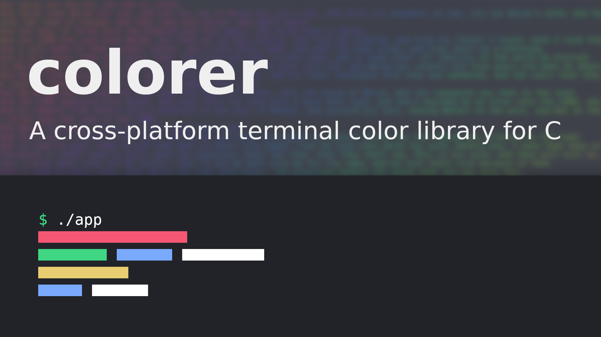
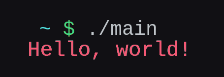

# !This project has been moved to [chol](https://github.com/LordOfTrident/chol)!

<h1 align="center">colorer</h1>
<p align="center">
	<a href="./LICENSE">
		
	</a>
	<a href="https://github.com/LordOfTrident/clog/issues">
		
	</a>
	<a href="https://github.com/LordOfTrident/clog/pulls">
		
	</a>
	
	<br><br><br>
</p>

A simple single-header [STB-style](https://github.com/nothings/stb) cross-platform C library for
terminal colors.

## Table of contents
* [Simple example](#simple-example)
* [Quickstart](#quickstart)
* [Bugs](#bugs)

## Simple example
```c
#include <stdio.h> /* printf */

#define COLORER_IMPLEMENTATION
#include "colorer.h"

int main(void) {
	color_init();

	color_fg(stdout, COLOR_RED);
	printf("Hello, red!\n");

	color_reset(stdout);
	return 0;
}
```
Output



## Quickstart
Copy [`colorer.h`](./colorer.h) into your project and include it.
[See the example](./examples/color.c) to see how to use the library.

To compile and run the example, run
```sh
$ cc ./examples/color.c -o color
$ ./color
```

## Bugs
If you find any bugs, please create an issue and report them.
